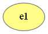
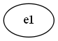
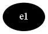
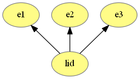
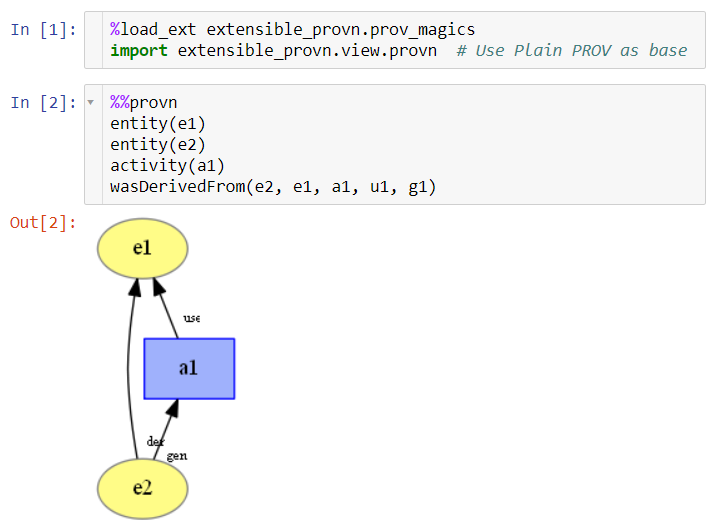

# Extensible PROV-N

This tool intends to provide a way to visualize and query PROV-N with custom extensions. It was extracted from the [Versioned-PROV repository](https://github.com/dew-uff/versioned-prov).

## Installation

This tool supports **Python 3.6** or greater. To install, please run:

```
$ pip install extensible_prov
```

## Basic visualization usage

This project installs three CLI commands to convert PROV-N to Graphviz Dot files:

* `provn`: converts Plain PROV-N to dot. It generates a graph similar to [ProvToolbox](https://lucmoreau.github.io/ProvToolbox/)
* `prov-dictionary`: converts PROV-Dictionary files to dot
* `versioned-prov`: converts Versioned-PROV files to dot

These three commands have the same interface. To convert a PROV-N file to dot, just run:
```
$ provn --infile input.prov --outfile output.dot
```

These commands also support input redirection:
```
echo "entity(e1)" | provn | dot -Tpng -o pipe.png
```



For other options, see the the help:
```
$ versioned-prov -h
usage: versioned-prov [-h] [-i INFILE] [-o OUTFILE] [-x WIDTH] [-y HEIGHT]
                      [-r RANKDIR] [-s STYLE]

Convert PROV-N to GraphViz Dot

optional arguments:
  -h, --help            show this help message and exit
  -i INFILE, --infile INFILE
                        Input PROV-N file
  -o OUTFILE, --outfile OUTFILE
                        Output dot file
  -x WIDTH, --width WIDTH
                        Graph width
  -y HEIGHT, --height HEIGHT
                        Graph height
  -r RANKDIR, --rankdir RANKDIR
                        Graph rankdir
  -s STYLE, --style STYLE
                        Graph style
```

## Styling

These commands support custom styles. It has four main built-in styles:

* `default`: Default style that highlights nodes and edges specific to Prov-Dictionary and Versioned-PROV
* `nohighlight`: Style that works for plain PROV, PROV-Dictionary, and Versioned-PROV, but does not highlight anything
* `blackwhite`: Black and white style based on `nohighlight`
* `provtoolbox`: Style based on [ProvToolbox](https://lucmoreau.github.io/ProvToolbox/). Labels are smaller than `nohighlight` style.

Usage:
```
echo "entity(e1)" | provn -s blackwhite | dot -Tpng -o blackwhite.png
```


### Defining new Styles

Styles are defined as modules with an EXPORT variable with a Style class. This class uses the `style` dictionary attribute to define individual styles for every element type.

In this dictionary, the *key* indicate which PROV-N statements or elements are affect by the style. Using a `*` at the end of the *key* overrides the other styles. It supports the following keys:
* `label`: applies to general labels
* `{statement}_label`: applies to statement labels
* `{statement}{part}_label`: applies to part of statement labels
* `arrow`: applies to general arrows
* `node`: applies to general nodes
* `{statement}`: applies to statement arrows or nodes
* `{statement}{part}`: applies to part of statement arrows
* `point`: applies to general points
* `{statement}_point`: applies to statement points
* `{statement}{part}_point`: applies to part of statement points
* `attrs`: applies to general optional attributes
* `{statement}_attrs`: applies to statement optional attributes
* `attrs_arrow`: applies to general optional attributes arrows
* `{statement}_attrs_arrow`: applies to statement optional attributes arrows
* `after`: applies to statements after other styles
* `arrow_after`: applies to arrows after other styles
* `point_after`: applies to points after other styles
* `node_after`: applies to nodes after other styles
* `attrs_after`: applies to optional attributes after other styles

In this dictionary, the *value* can be either a dictionary with dot attributes, or a function that receives the statement and the attributes as arguments and returns a dictionary with dot attributes.

The following [module](opposite_bw.py) code presents a style example that outputs the opposite colors of the blackwhite style:

```python
from extensible_provn.view.style.nohighlight import NoHighlightStyle

class WhiteBlackStyle(NoHighlightStyle):

    def __init__(self):
        super(WhiteBlackStyle, self).__init__()
        self.style = self.join(self.style, {
            "entity": {"fillcolor": "#000000", "fontcolor": "#FFFFFF", "style": "filled"},
            "activity": {
                "fillcolor": "#000000", "fontcolor": "#FFFFFF",
                "shape": "polygon", "sides": "4", "style": "filled"
            },
            "agent": {"fillcolor": "#000000", "fontcolor": "#FFFFFF", "shape": "house", "style": "filled"},
            "value": {"fillcolor": "#000000", "fontcolor": "#FFFFFF", "style": "filled"},
            "version": {"fillcolor": "#000000", "fontcolor": "#FFFFFF", "style": "filled"},
        })


EXPORT = WhiteBlackStyle
```

Usage:
```
echo "entity(e1)" | provn -s opposite_bw | dot -Tpng -o opposite_bw.png
```



Other styles that can be used as reference are available at: https://github.com/JoaoFelipe/extensible_provn/tree/master/extensible_provn/view/style

## Extending PROV-N with views

This project supports extending PROV-N by adding new statements or overriding existing ones to add more options. It can be performed by using the decorator view.dot.graph.prov as following:

```python
"""
PROV-N with entlist(lid; e1, e2, ..., en) statement that is equivalent to:
entity(lid)
entity(e1)
hadMember(lid, e1)
entity(e2)
hadMember(lid, e2)
...
entity(en)
hadMember(lid, en)
"""

from extensible_provn.view import provn  # Use Plain PROV as base
from extensible_provn.view.dot import graph

@graph.prov("entlist")
def entlist(dot, *args, attrs=None, id_=None):
    lines = [dot.node(attrs, "entity", id_)]
    for entity_id in args:
        lines.append(dot.node(attrs, "entity", entity_id))
        lines.append(dot.arrow2(attrs, "hadMember", id_, entity_id))
    return "\n".join(lines)

if __name__ == "__main__":
    graph.main()
```
Note: This code is valid for Python 3. Some changes are required for Python 2.

The `graph.main()` adds the default CLI to this extension.

Usage:

```
echo "entlist(lid; e1, e2, e3)" | python prov_list.py | dot -Tpng -o prov_list.png
```



## Jupyter Integration

Besides the CLI for converting PROV-N files to GraphViz files, this project also provides a *Cell Magic* to visualize the Provenance in Jupyter Noteboks. To do so, you must load the IPython extension and import the desirable PROV-N extension as follows:

```python
%load_ext extensible_provn.prov_magics
import extensible_provn.view.provn  # Use Plain PROV as base
```

And then, use the `%%provn` cell magic in a Cell that you want to display the Graph.



Note that it requires GraphViz to be installed. The option `-e pdf` may also benefit from an inkscape installation. However it uses GraphViz if inkscape is not installed.

## Querying

Besides visualizing provenance, we also support querying PROV-N files by pattern matching. The built-in queries are rather simple and incomplete, but extending them is similar to creating a visualization extension.

```python
"""Defines a pattern matching query for entlist"""
from extensible_provn.query.provn import *

@querier.prov("entlist", ["id", "elements", "text"])
def entlist(querier, eid, *args, attrs={}, id_=None):
    return [
        id_, args,
        querier.text("entlist", list(args), attrs, id_)
    ]
```

This code does not need to be in a separate python file. It can be in a notebook.

Then, to execute the query, you must load it into the querier:

```python
querier.load_text("""
entity(lid1)
entlist(lid1; e1, e2, e3)
entlist(lid2; e4, e5)
""")
```

And execute the pattern matching queries:

```python
Eid, Elements, Text = var("Eid Elements Text")
_ = BLANK
for __ in entity(Eid, _) & entlist(Eid, Elements, Text):
    print(Eid.bound, Elements.bound, Text.bound)
```
This query gets all entities that share the entity id with entlist, and prints their id, a tuple with the entlist elements, and the entlist text.

Output:
```
lid1 ('e2', 'e3') entlist(lid1; e2, e3)
```

Note in the query that we define variables (`var`) for elements that we want to extract and join across multiple rules. Additionally, we use `BLANK` for elements we want to ignore.

Note also that the query function signature is based on the second argument of the `@querier.prov` decorator. Thus, the `entlist` query accepts only 3 parameters, while the `entlist` statement may accept many more.

## Contributing

Feel free to contribute with this project and submit pull requests, bug reports, or questions as issues.

To install the project for development, please run on the root of the repository.
```
$ pip install -e .
```